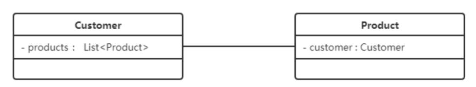
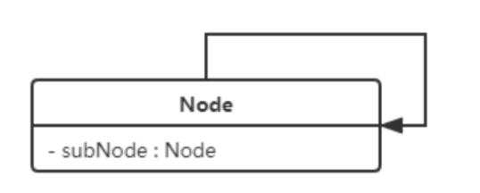
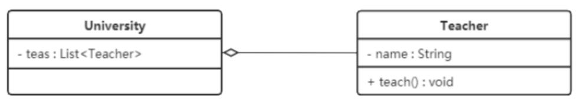
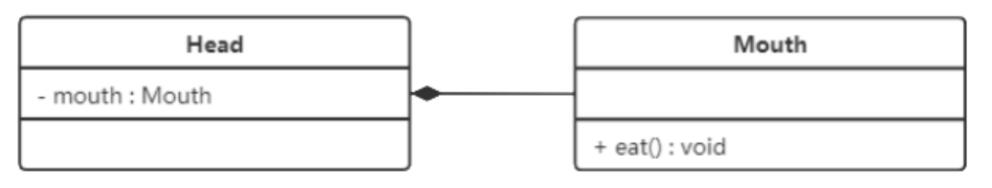
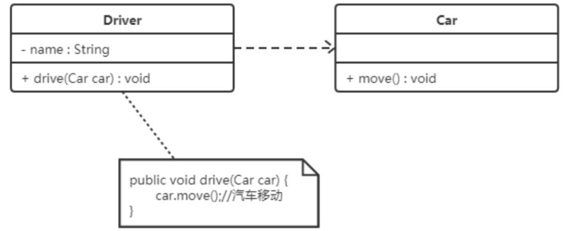
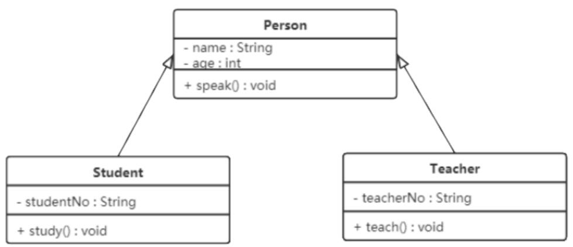
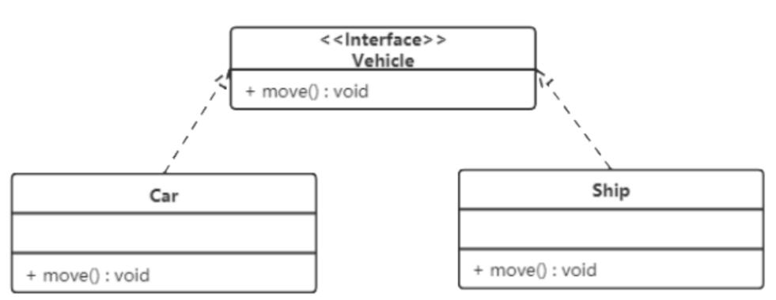

# 设计模式概述

## 设计模式分类

#### 1、创建型模式
    将对象的创建与使用进行分离（解耦）
    单例、原型、工厂方法、抽象工厂、建造者等
    
#### 2、结构型模式
    将类与对象按某种布局组成更大的结构
    代理、适配器、桥接、装饰、外观、亨元、组合等
    
#### 3、行为型模式
    类与对象分配职责，相互协作，共同完成单个对象无法完成的任务
    模板方法、策略、命令、职责链、状态、观察者、中介者、迭代器、访问者、备忘录、解释器

## UML

#### 1、基本概念
    Unified Modeling Language：统一建模语言
    软件可视化建模语言
    用例图、**类图**、对象图、状态图、活动图、时序图、协作图、构件图、部署图等
#### 2、类图
    不显示暂时性的信息
#### 3、类与类之间的关系
- 3.1 关联关系：对象之间的引用关系（老师与学生）  
    - 单向关联：B类对象是A类的成员变量，类A实心三角箭头实线指向类B  
      

    - 双向关联：A类对象和B类对象相互作为对方成员变量的引用类型  
      一个顾客购买了多个商品，其中一个商品的购买者是某个顾客）  
      类A和类B实线连接  
      
    
    - 自关联：A类对象是A类自己的成员变量，类A实心三角箭头实线指向自己
      
       
- 3.2 聚合关系：整体和部分的关系（学校与老师）
    - 成员对象是整体对象的一部分，也可脱离整体对象而独立存在
    - 成员对象空心菱形箭头实线指向整体对象
    
    
- 3.3 组合关系：表示类之间的整体与部分的关系，更强烈的聚合关系
    - 整体对象可控制部分对象的生命周期（头和嘴）
    - 部分对象实心菱形箭头实线指向整体对象
    
    
- 3.4 依赖关系：使用关系
    - 临时性的关联
    - 某个类（使用类）的方法通过局部变量、方法的参数、静态方法的调用来访问另一个类（被依赖类）中的某些方法来完成职责
    - 使用类虚线指向被依赖类
    
    
- 3.5 继承关系：父类与子类的关系
     - 也表示泛化关系
     - 对象之间耦合度最大的一种关系
     - 子类空心三角箭头实线指向父类
     
     
- 3.6 实现关系：接口与实现类的关系
     - 实现类空心三角箭头虚线指向接口
     